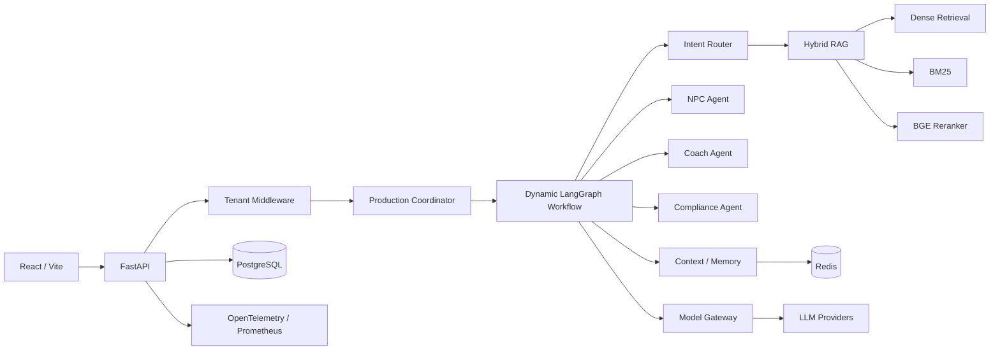

<div align="center">

# SalesBoost

### Enterprise AI Sales Enablement Platform

**A production-shaped multi-agent system for sales training, deal execution, live assistance, and methodology-aware coaching.**

`LangGraph` · `FastAPI` · `React` · `Hybrid RAG` · `Redis` · `PostgreSQL` · `OpenTelemetry`

[Full Technical README](../README.md) · [Backend](../backend/) · [Frontend](../frontend/) · [Tests](../backend/tests/)

</div>

---

## Why this project matters

SalesBoost is not a single-chatbot demo. It is an end-to-end AI application that separates **orchestration, retrieval, memory, model access, evaluation, compliance, and product workflows** so each layer can be tested and evolved independently.

The product covers the complete sales loop: **training → battle preparation → live assistance → post-call review → pipeline / executive analytics**.

## Demo / Product Surface

| Surface | What it demonstrates |
|---|---|
| **AI Sales Training** | NPC simulation, coaching, strategy evaluation |
| **Battle Prep** | methodology state, gaps, talking points |
| **Live Assist** | real-time AI copilot workflow |
| **Pipeline** | deal lifecycle with MEDDPICC / SPIN / Challenger |
| **Executive Cockpit** | funnel and methodology-level analytics |

Implemented product pages and APIs are linked from the [full technical README](../README.md).

## Architecture



## Evidence — what is actually implemented

| Capability | Repository evidence |
|---|---|
| Dynamic multi-agent workflow | [`dynamic_workflow.py`](../backend/app/engine/coordinator/dynamic_workflow.py) |
| Production coordinator facade | [`production_coordinator.py`](../backend/app/engine/coordinator/production_coordinator.py) |
| Hybrid retrieval | [`vector_store.py`](../backend/app/infra/search/vector_store.py) · [`bm25_retriever.py`](../backend/app/infra/search/bm25_retriever.py) |
| Self-RAG / reflection | [`self_rag.py`](../backend/app/retrieval/self_rag.py) |
| HyDE retrieval | [`hyde_retriever.py`](../backend/app/retrieval/hyde_retriever.py) |
| Multi-tier context / memory | [`memory.py`](../backend/app/context_manager/memory.py) |
| Self-correcting tool execution | [`reflection.py`](../backend/app/tools/reflection.py) · [`executor.py`](../backend/app/tools/executor.py) |
| Multi-provider model gateway | [`model_gateway.py`](../backend/app/infra/gateway/model_gateway.py) |
| Golden regression tests | [`test_golden_regression.py`](../backend/tests/unit/test_golden_regression.py) |
| Observability | [`otel_tracing.py`](../backend/app/observability/otel_tracing.py) · [`prometheus_exporter.py`](../backend/app/observability/prometheus_exporter.py) |

## Quick Start

```bash
git clone https://github.com/Benjamindaoson/SalesBoost.git
cd SalesBoost

# backend
cd backend
pip install -r requirements.txt
python main.py

# frontend — new terminal
cd frontend
npm install
npm run dev
```

Configure `.env` for the model provider and optional PostgreSQL / Redis services. The complete setup, configuration, architecture notes, feature matrix, and roadmap remain in the **[full README](../README.md)**.

---

<div align="center">

**Agent orchestration · retrieval · memory · evaluation · observability · product delivery**

</div>
