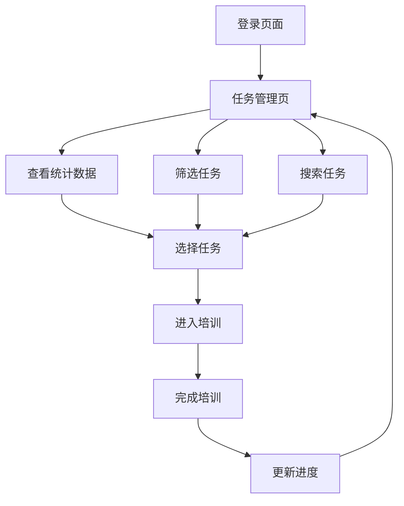

## 1. 产品概述

AI销售培训代理仪表板是一个专为销售团队设计的智能培训任务管理系统。通过AI技术赋能，帮助销售人员高效管理和完成各类销售技能培训课程，提升销售业绩和专业能力。

目标用户为销售团队成员和管理者，通过系统化的任务管理、进度跟踪和成绩评估，实现销售技能的持续提升和团队业绩的优化。

## 2. 核心功能

### 2.1 用户角色

| 角色    | 注册方式   | 核心权限                  |
| ----- | ------ | --------------------- |
| 销售人员  | 企业邮箱注册 | 查看和完成培训任务、查看个人进度和成绩   |
| 销售主管  | 管理员分配  | 管理团队成员任务、查看团队统计、发布新任务 |
| 系统管理员 | 后台创建   | 系统配置、用户管理、数据统计        |

### 2.2 功能模块

本销售AI系统包含以下核心页面：

1. **任务管理页**：数据统计卡片、任务筛选、任务列表展示、搜索功能
2. **客户列表页**：客户信息管理、跟进记录、销售机会跟踪
3. **历史记录页**：培训历史、成绩记录、学习轨迹

### 2.3 页面详情

| 页面名称  | 模块名称   | 功能描述                                                  |
| ----- | ------ | ----------------------------------------------------- |
| 任务管理页 | 顶部导航栏  | 显示系统标题"AI Sales Training Agent"，包含分享、切换视角、查看H5版本等操作按钮 |
| 任务管理页 | 侧边栏导航  | 应用标识、主导航菜单（任务管理、客户列表、历史记录）、底部操作（发布、我的）                |
| 任务管理页 | 统计卡片区域 | 展示全部任务数、进行中任务数、已完成任务数、平均分数、锁定项目等关键指标                  |
| 任务管理页 | 筛选和搜索  | 状态筛选（全部、未开启、进行中、已结束）、搜索框支持课程名称和任务名称搜索                 |
| 任务管理页 | 任务列表表格 | 显示课程名称、任务信息、状态、时间范围、进度条、操作按钮（去练习、编辑、删除）               |
| 客户列表页 | 客户信息管理 | 客户基本信息展示、联系记录、销售阶段跟踪                                  |
| 历史记录页 | 学习历史   | 培训完成记录、成绩统计、学习时长统计                                    |

## 3. 核心流程

用户主要操作流程：

1. 用户登录系统后进入任务管理页面
2. 查看顶部统计卡片了解整体任务情况
3. 使用筛选器和搜索功能快速定位目标任务
4. 点击"去练习"按钮开始培训任务
5. 完成任务后系统自动更新进度和成绩

## 4. 用户界面设计

### 4.1 设计风格

* **主色调**：紫色（#6f53ff）作为主要品牌色，用于活跃状态、按钮、进度条

* **辅助色**：绿色表示成功/完成状态，蓝色表示进行中，灰色表示默认状态

* **按钮样式**：圆角矩形按钮，主要操作为实心紫色，次要操作为边框样式

* **字体**：现代无衬线字体，标题使用中等粗细，正文使用常规粗细

* **布局风格**：左侧导航栏 + 右侧内容区的经典管理后台布局

* **图标风格**：简洁的线性图标，与文字搭配使用

### 4.2 页面设计概览

| 页面名称  | 模块名称 | UI元素                     |
| ----- | ---- | ------------------------ |
| 任务管理页 | 统计卡片 | 白色圆角卡片，紫色图标，黑色数字显示，灰色副标题 |
| 任务管理页 | 筛选按钮 | 紫色实心圆角标签表示选中状态，灰色边框表示未选中 |
| 任务管理页 | 任务表格 | 白色背景圆角面板，表头灰色文字，交替行浅色背景  |
| 任务管理页 | 进度条  | 紫色填充进度条，显示完成度分数          |
| 任务管理页 | 状态标签 | 紫色表示进行中，绿色表示已完成，灰色表示未开始  |

### 4.3 响应式设计

* 桌面优先设计，默认适配1920px宽度

* 支持1200px以上平板设备横屏显示

* 移动端采用H5版本，单独适配小屏幕交互

* 触摸交互优化，按钮和链接具有足够的点击区域

