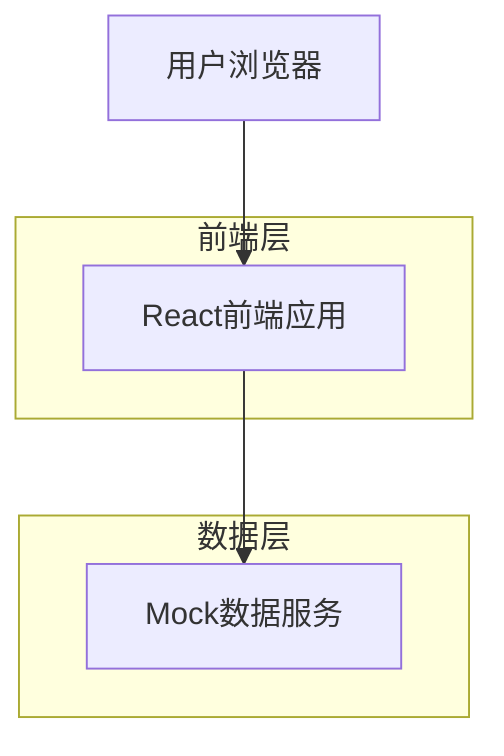

## 1. 架构设计



## 2. 技术描述

- **前端**：React@18 + Tailwind CSS@3 + Vite
- **初始化工具**：vite-init
- **后端**：无（使用Mock数据）
- **状态管理**：React Context + useReducer
- **路由**：React Router@6
- **UI组件库**：Headless UI + 自定义组件
- **图标**：Lucide React
- **开发工具**：ESLint + Prettier + TypeScript

## 3. 路由定义

| 路由 | 用途 |
|------|------|
| / | 任务管理页，默认首页 |
| /customers | 客户列表页，管理客户信息 |
| /history | 历史记录页，查看培训历史 |
| /profile | 个人中心，用户设置和信息 |

## 4. 性能指标

### 4.1 核心性能指标
- **LCP（最大内容绘制）**：< 1.5秒
- **TBT（总阻塞时间）**：< 200ms
- **CLS（累积布局偏移）**：< 0.1
- **FID（首次输入延迟）**：< 100ms

### 4.2 优化策略
- 使用Vite进行构建优化和代码分割
- 图片资源使用WebP格式并设置适当尺寸
- 组件懒加载和路由级别的代码分割
- 使用React.memo和useMemo优化重渲染
- Tailwind CSS的Purge功能移除未使用的样式

## 5. 浏览器兼容性

- Chrome：最新2个版本
- Edge：最新2个版本
- Firefox：最新2个版本
- Safari：最新2个版本
- 移动端：iOS Safari 14+，Chrome for Android

## 6. 文件结构规范

```
src/
├── components/          # 通用组件
│   ├── common/         # 基础组件（Button, Card, Table等）
│   ├── layout/         # 布局组件（Sidebar, Header等）
│   └── ui/             # UI组件库
├── pages/              # 页面组件
│   ├── Dashboard/      # 任务管理页
│   ├── Customers/      # 客户列表页
│   └── History/        # 历史记录页
├── hooks/              # 自定义Hook
├── context/            # 全局状态管理
├── services/           # API服务和Mock数据
├── utils/              # 工具函数
├── types/              # TypeScript类型定义
├── styles/             # 全局样式和Tailwind配置
└── assets/             # 静态资源
```

## 7. Mock数据结构

### 7.1 任务数据模型
```typescript
interface Task {
  id: string;
  courseName: string;
  courseSubtitle?: string;
  taskInfo: string;
  taskTag: string;
  status: 'pending' | 'in-progress' | 'completed' | 'paused';
  timeRange: {
    start: string;
    end: string;
  };
  progress: {
    completed: number;
    total: number;
    bestScore?: number;
  };
  participants?: number;
  instructor?: string;
}
```

### 7.2 统计数据模型
```typescript
interface Statistics {
  totalTasks: number;
  inProgress: number;
  completed: number;
  averageScore: number;
  lockedItems?: number;
}
```

## 8. 响应式断点

- **桌面端**：> 1280px（默认）
- **平板端**：768px - 1280px
- **移动端**：< 768px（H5版本）

## 9. 交付要求

1. **代码规范**：遵循Airbnb JavaScript Style Guide
2. **TypeScript**：严格模式，完整的类型定义
3. **测试**：核心组件单元测试覆盖率>80%
4. **文档**：组件使用文档和API文档
5. **部署**：提供Docker容器化部署方案
6. **监控**：集成性能监控和错误上报