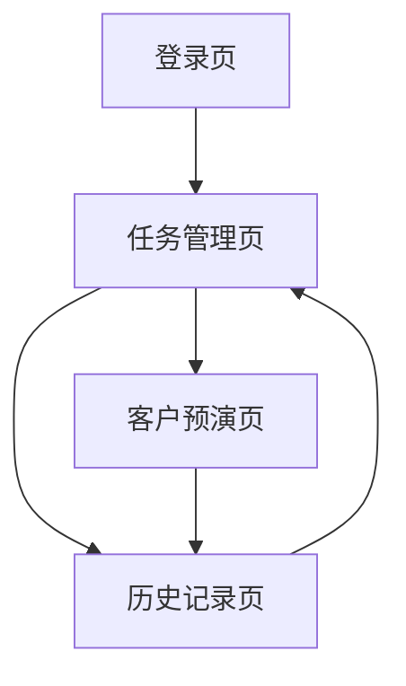

## 1. 产品概述
销冠AI系统 - 学员端是一个AI驱动的销售培训平台，帮助销售人员通过模拟客户对话和任务训练提升销售技能。

专为销售学员设计，提供个性化客户预演、任务管理和学习进度追踪功能。

## 2. 核心功能

### 2.1 用户角色
| 角色 | 注册方式 | 核心权限 |
|------|----------|----------|
| 销售学员 | 邮箱注册/Google账号 | 访问任务管理、客户预演、历史记录 |

### 2.2 功能模块
销冠AI系统学员端包含以下核心页面：
1. **任务管理页**：展示学习任务列表、进度统计、筛选功能
2. **客户预演页**：创建和管理客户角色卡片，进行销售情景演练
3. **历史记录页**：查看练习历史、得分统计、时长记录

### 2.3 页面详情
| 页面名称 | 模块名称 | 功能描述 |
|-----------|-------------|-------------|
| 任务管理 | 顶部导航栏 | 显示AI logo、系统标题、用户登录入口 |
| 任务管理 | 左侧边栏 | 用户头像、系统名称、菜单导航、底部链接 |
| 任务管理 | 统计卡片 | 显示全部任务数、进行中任务、已完成任务、平均分数 |
| 任务管理 | 搜索筛选 | 支持课程名称搜索、状态筛选（全部/未开始/进行中/已结束） |
| 任务管理 | 任务表格 | 展示课程名称、任务信息、状态、时间范围、进度、操作按钮 |
| 客户预演 | 客户卡片网格 | 3列布局展示客户角色卡片，包含头像、基本信息、标签 |
| 客户预演 | 新建角色按钮 | 紫色渐变按钮，用于创建新的客户预演角色 |
| 历史记录 | 统计卡片 | 显示总练习次数、平均分数、最高分数、总练习时长 |
| 历史记录 | 筛选控件 | 时间筛选、分数筛选、导出功能、刷新按钮 |
| 历史记录 | 记录表格 | 展示练习时间、课程信息、客户角色、类别、时长、得分 |

## 3. 核心流程
学员使用流程：登录系统 → 查看任务列表 → 选择任务进行练习 → 创建客户角色进行预演 → 查看练习历史和得分

## 4. 用户界面设计

### 4.1 设计风格
- **主色调**：紫色渐变 (#7A5AF8 到 #9B8AFB)
- **按钮样式**：圆角设计，主要操作为紫色渐变
- **字体**：无衬线字体，标题半粗体，正文常规
- **布局样式**：左侧固定边栏 + 右侧内容区域，卡片式布局
- **图标风格**：线性图标，灰色系

### 4.2 页面设计概览
| 页面名称 | 模块名称 | UI元素 |
|-----------|-------------|-------------|
| 任务管理 | 统计卡片 | 白色卡片、柔和阴影、圆角、渐变紫色高亮 |
| 任务管理 | 状态标签 | 蓝色(进行中)、灰色(未开始)、绿色(已结束)圆角标签 |
| 客户预演 | 客户卡片 | 紫蓝色渐变头部、白色内容区、圆形头像占位符 |
| 历史记录 | 得分徽章 | 彩色圆角徽章(蓝/橙/绿)，大字号数字 |

### 4.3 响应式设计
桌面优先设计，适配平板和移动端，支持触摸交互优化