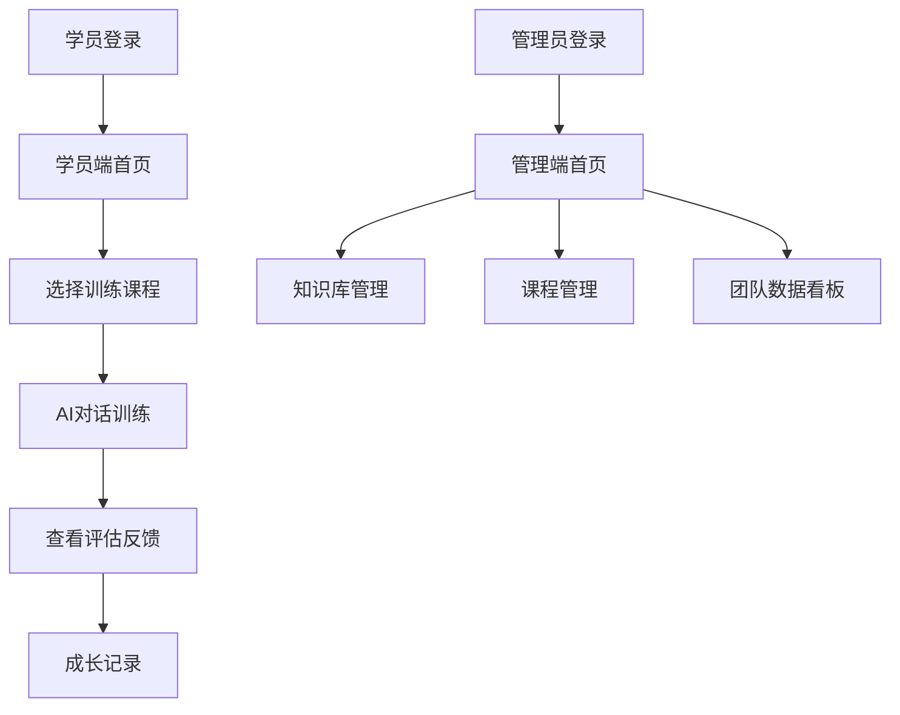

## 1. 产品概述

SalesBoost是销售冠军能力复制SaaS平台，专为信用卡KOS销售团队设计。解决80人销售团队中88%月发卡仅0-3张的核心痛点，通过AI对话训练帮助普通销售掌握"该怎么问、怎么推、怎么接异议"的销售技巧。

目标实现普通销售人均月发卡量提升10-30%，打造可量化的销售培训效果闭环。

## 2. 核心功能

### 2.1 用户角色

| 角色 | 注册方式 | 核心权限 |
|------|----------|----------|
| 学员用户 | 管理员分配账号 | 课程学习、AI对练、查看评估反馈、个人成长记录 |
| 管理员 | 超级管理员创建 | 知识库管理、课程配置、评估体系设置、团队数据看板 |

### 2.2 功能模块

SalesBoost核心功能包含以下主要页面：

1. **学员端首页**：课程任务列表、学习进度概览、快速开始训练入口
2. **AI对话训练**：沉浸式客户对练、实时教练提示、情境化角色展示
3. **评估反馈**：多维能力评分、可视化雷达图、逐句对话点评、改进建议
4. **成长记录**：历史训练追踪、能力趋势分析、个人发展轨迹
5. **管理端首页**：团队能力分布热力图、共性问题识别、培训ROI数据
6. **知识库管理**：文档上传、生效控制、版本管理
7. **课程管理**：场景编辑器、客户角色模板、评估规则配置

### 2.3 页面详情

| 页面名称 | 模块名称 | 功能描述 |
|----------|----------|----------|
| 学员端首页 | 课程任务区 | 展示待完成课程列表，包含课程名称、进度状态、截止时间，支持一键开始训练 |
| 学员端首页 | 学习概览 | 显示本月训练次数、平均得分、能力成长趋势，提供快速统计卡片 |
| AI对话训练 | 对话界面 | 类ChatGPT沉浸式对话体验，支持文字输入，实时显示客户角色回应 |
| AI对话训练 | 教练提示浮层 | 不打断对话流的情况下，实时显示销售技巧提示、合规提醒、话术建议 |
| AI对话训练 | 客户角色展示 | 显示客户头像、背景信息、当前情绪状态，增强情境化体验 |
| AI对话训练 | 进度追踪 | 实时显示对话轮数、目标完成度、剩余时间，提供暂停和结束选项 |
| 评估反馈 | 能力雷达图 | 可视化展示沟通能力、产品知识、异议处理、成交技巧等维度得分 |
| 评估反馈 | 对话点评 | 逐句分析对话内容，标注优秀表现和待改进点，提供具体改进建议 |
| 评估反馈 | 改进建议 | 基于评估结果生成个性化改进计划，包含具体练习建议和学习资源推荐 |
| 成长记录 | 历史列表 | 按时间顺序展示所有训练记录，支持按课程类型、得分区间筛选 |
| 成长记录 | 能力趋势 | 折线图展示各项能力随时间变化趋势，支持自定义时间范围 |
| 管理端首页 | 团队概览 | 显示团队总人数、活跃训练人数、平均能力提升幅度等关键指标 |
| 管理端首页 | 能力分布图 | 热力图展示团队在各项能力维度的分布情况，快速识别薄弱环节 |
| 管理端首页 | 共性问题 | 自动识别团队普遍存在的问题，按出现频率排序，支持查看详情 |
| 知识库管理 | 文档上传 | 支持PDF、Word、Excel等格式文件上传，自动解析内容并建立索引 |
| 知识库管理 | 生效控制 | 设置知识文档生效时间、适用范围，支持版本更新和回滚 |
| 课程管理 | 场景编辑器 | 拖拽式界面配置客户角色、对话场景、评估标准，支持预览功能 |
| 课程管理 | 角色模板库 | 预设多种客户角色模板（价格敏感型、质量关注型等），支持自定义修改 |

## 3. 核心流程

### 学员用户流程
学员登录后进入首页查看课程任务，选择合适的训练课程开始AI对话练习。在对话过程中接收实时教练提示，完成训练后查看详细评估反馈和改进建议。可随时查看个人成长记录和能力发展趋势。

### 管理员流程
管理员登录管理端查看团队整体数据，识别共性问题和能力短板。通过知识库管理更新培训材料，使用课程管理配置新的训练场景和评估规则。

## 4. 用户界面设计

### 4.1 设计风格

- **主色调**：专业蓝(#1E40AF)搭配活力橙(#F59E0B)，体现专业性与活力感
- **辅助色**：中性灰系(#6B7280, #9CA3AF)用于文字和边框
- **按钮样式**：圆角矩形设计，主要操作使用主色调，次要操作用outline样式
- **字体体系**：
  - 标题：思源黑体 24-32px 加粗
  - 正文：PingFang SC 14-16px 常规
  - 辅助文字：12px 浅灰色
- **布局风格**：左侧导航+右侧内容区的经典SaaS布局，卡片式内容组织
- **图标风格**：使用简洁线性图标，保持视觉一致性

### 4.2 页面设计概览

| 页面名称 | 模块名称 | UI元素 |
|----------|----------|--------|
| 学员端首页 | 顶部导航 | 用户头像、退出按钮、系统通知图标，右侧显示当前日期 |
| 学员端首页 | 课程卡片 | 白色圆角卡片，包含课程封面图、标题、进度条、开始按钮 |
| AI对话训练 | 对话区域 | 类似微信聊天界面，用户消息右侧显示，客户消息左侧显示 |
| AI对话训练 | 提示浮层 | 半透明蓝色背景，显示在对话区域上方，3秒后自动消失 |
| 评估反馈 | 雷达图 | 六边形雷达图，不同能力维度用不同颜色区分，显示具体数值 |
| 管理端首页 | 数据卡片 | 大字号显示关键指标，使用图标增强识别度，绿色表示良好 |
| 知识库管理 | 文件列表 | 表格形式展示文件名、上传时间、状态，支持搜索和筛选 |
| 课程管理 | 编辑器 | 左侧组件库，中间画布区域，右侧属性面板，类似低代码平台 |

### 4.3 响应式设计

采用桌面端优先设计策略，确保在1920×1080分辨率下最佳显示效果。支持1366×768及以上分辨率自适应，关键功能在平板端（768px以上）可用。考虑到销售培训场景主要发生在办公室环境，暂不做移动端深度适配。

### 4.4 交互细节

- **加载状态**：使用骨架屏和进度条，避免用户焦虑
- **操作反馈**：按钮点击有短暂变色效果，重要操作显示确认弹窗
- **错误处理**：友好错误提示，提供解决方案建议
- **键盘快捷键**：支持Enter发送消息、Esc关闭弹窗等常用操作