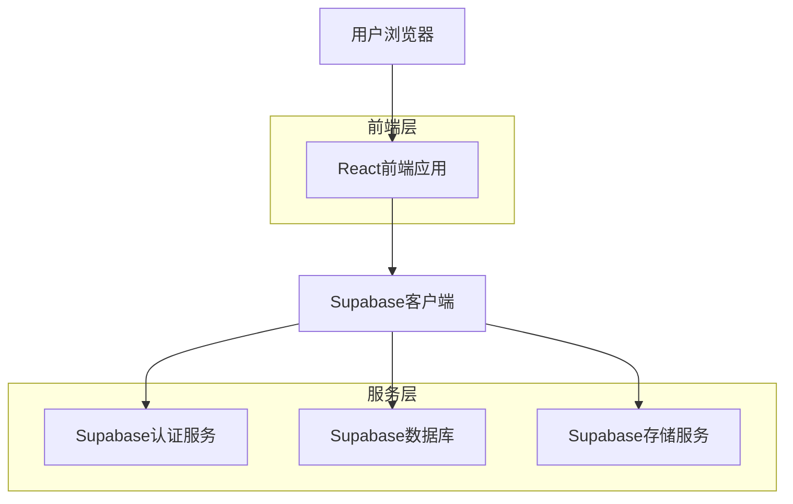
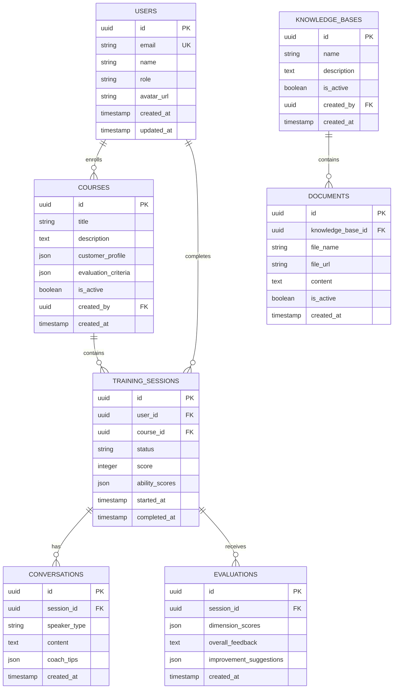

## 1. 架构设计



## 2. 技术描述

- **前端框架**: React@18 + TypeScript@5
- **构建工具**: Vite@5
- **样式方案**: Tailwind CSS@3 + Headless UI
- **状态管理**: React Context + useReducer
- **路由管理**: React Router@6
- **UI组件库**: 自定义组件 + Radix UI
- **图表库**: Recharts@2
- **初始化工具**: vite-init
- **后端服务**: Supabase (BaaS)

## 3. 路由定义

| 路由 | 用途 |
|------|------|
| /login | 登录页面，支持邮箱密码登录 |
| /student/dashboard | 学员端首页，课程任务概览 |
| /student/training/:courseId | AI对话训练页面 |
| /student/feedback/:sessionId | 评估反馈详情页面 |
| /student/records | 个人成长记录页面 |
| /admin/dashboard | 管理端首页，团队数据看板 |
| /admin/knowledge | 知识库管理页面 |
| /admin/courses | 课程管理页面 |
| /admin/courses/new | 新建课程页面 |
| /admin/courses/edit/:id | 编辑课程页面 |
| /admin/analytics | 数据分析页面 |

## 4. 数据模型

### 4.1 核心数据模型



### 4.2 数据定义语言

用户表 (users)
```sql
-- 创建用户表
CREATE TABLE users (
    id UUID PRIMARY KEY DEFAULT gen_random_uuid(),
    email VARCHAR(255) UNIQUE NOT NULL,
    name VARCHAR(100) NOT NULL,
    password_hash VARCHAR(255) NOT NULL,
    role VARCHAR(20) DEFAULT 'student' CHECK (role IN ('student', 'admin')),
    avatar_url TEXT,
    created_at TIMESTAMP WITH TIME ZONE DEFAULT NOW(),
    updated_at TIMESTAMP WITH TIME ZONE DEFAULT NOW()
);

-- 创建索引
CREATE INDEX idx_users_email ON users(email);
CREATE INDEX idx_users_role ON users(role);

-- 设置权限
GRANT SELECT ON users TO anon;
GRANT ALL PRIVILEGES ON users TO authenticated;
```

课程表 (courses)
```sql
-- 创建课程表
CREATE TABLE courses (
    id UUID PRIMARY KEY DEFAULT gen_random_uuid(),
    title VARCHAR(200) NOT NULL,
    description TEXT,
    customer_profile JSONB NOT NULL,
    evaluation_criteria JSONB NOT NULL,
    is_active BOOLEAN DEFAULT true,
    created_by UUID REFERENCES users(id),
    created_at TIMESTAMP WITH TIME ZONE DEFAULT NOW(),
    updated_at TIMESTAMP WITH TIME ZONE DEFAULT NOW()
);

-- 创建索引
CREATE INDEX idx_courses_active ON courses(is_active);
CREATE INDEX idx_courses_created_by ON courses(created_by);

-- 设置权限
GRANT SELECT ON courses TO anon;
GRANT ALL PRIVILEGES ON courses TO authenticated;
```

训练会话表 (training_sessions)
```sql
-- 创建训练会话表
CREATE TABLE training_sessions (
    id UUID PRIMARY KEY DEFAULT gen_random_uuid(),
    user_id UUID REFERENCES users(id) ON DELETE CASCADE,
    course_id UUID REFERENCES courses(id) ON DELETE CASCADE,
    status VARCHAR(20) DEFAULT 'in_progress' CHECK (status IN ('in_progress', 'completed', 'abandoned')),
    score INTEGER CHECK (score >= 0 AND score <= 100),
    ability_scores JSONB,
    started_at TIMESTAMP WITH TIME ZONE DEFAULT NOW(),
    completed_at TIMESTAMP WITH TIME ZONE,
    created_at TIMESTAMP WITH TIME ZONE DEFAULT NOW()
);

-- 创建索引
CREATE INDEX idx_sessions_user_id ON training_sessions(user_id);
CREATE INDEX idx_sessions_course_id ON training_sessions(course_id);
CREATE INDEX idx_sessions_status ON training_sessions(status);
CREATE INDEX idx_sessions_started_at ON training_sessions(started_at DESC);

-- 设置权限
GRANT SELECT ON training_sessions TO anon;
GRANT ALL PRIVILEGES ON training_sessions TO authenticated;
```

对话记录表 (conversations)
```sql
-- 创建对话记录表
CREATE TABLE conversations (
    id UUID PRIMARY KEY DEFAULT gen_random_uuid(),
    session_id UUID REFERENCES training_sessions(id) ON DELETE CASCADE,
    speaker_type VARCHAR(20) CHECK (speaker_type IN ('user', 'ai_customer', 'coach')),
    content TEXT NOT NULL,
    coach_tips JSONB,
    created_at TIMESTAMP WITH TIME ZONE DEFAULT NOW()
);

-- 创建索引
CREATE INDEX idx_conversations_session_id ON conversations(session_id);
CREATE INDEX idx_conversations_created_at ON conversations(created_at);

-- 设置权限
GRANT SELECT ON conversations TO anon;
GRANT ALL PRIVILEGES ON conversations TO authenticated;
```

评估表 (evaluations)
```sql
-- 创建评估表
CREATE TABLE evaluations (
    id UUID PRIMARY KEY DEFAULT gen_random_uuid(),
    session_id UUID REFERENCES training_sessions(id) ON DELETE CASCADE,
    dimension_scores JSONB NOT NULL,
    overall_feedback TEXT,
    improvement_suggestions JSONB,
    created_at TIMESTAMP WITH TIME ZONE DEFAULT NOW()
);

-- 创建索引
CREATE INDEX idx_evaluations_session_id ON evaluations(session_id);

-- 设置权限
GRANT SELECT ON evaluations TO anon;
GRANT ALL PRIVILEGES ON evaluations TO authenticated;
```

知识库表 (knowledge_bases)
```sql
-- 创建知识库表
CREATE TABLE knowledge_bases (
    id UUID PRIMARY KEY DEFAULT gen_random_uuid(),
    name VARCHAR(200) NOT NULL,
    description TEXT,
    is_active BOOLEAN DEFAULT true,
    created_by UUID REFERENCES users(id),
    created_at TIMESTAMP WITH TIME ZONE DEFAULT NOW(),
    updated_at TIMESTAMP WITH TIME ZONE DEFAULT NOW()
);

-- 创建索引
CREATE INDEX idx_knowledge_bases_active ON knowledge_bases(is_active);

-- 设置权限
GRANT SELECT ON knowledge_bases TO anon;
GRANT ALL PRIVILEGES ON knowledge_bases TO authenticated;
```

文档表 (documents)
```sql
-- 创建文档表
CREATE TABLE documents (
    id UUID PRIMARY KEY DEFAULT gen_random_uuid(),
    knowledge_base_id UUID REFERENCES knowledge_bases(id) ON DELETE CASCADE,
    file_name VARCHAR(255) NOT NULL,
    file_url TEXT NOT NULL,
    content TEXT,
    is_active BOOLEAN DEFAULT true,
    created_at TIMESTAMP WITH TIME ZONE DEFAULT NOW(),
    updated_at TIMESTAMP WITH TIME ZONE DEFAULT NOW()
);

-- 创建索引
CREATE INDEX idx_documents_knowledge_base_id ON documents(knowledge_base_id);
CREATE INDEX idx_documents_active ON documents(is_active);

-- 设置权限
GRANT SELECT ON documents TO anon;
GRANT ALL PRIVILEGES ON documents TO authenticated;
```

## 5. 前端组件架构

### 5.1 核心组件结构

```
src/
├── components/
│   ├── common/          # 通用组件
│   │   ├── Button.tsx
│   │   ├── Card.tsx
│   │   ├── Modal.tsx
│   │   └── Loading.tsx
│   ├── layout/          # 布局组件
│   │   ├── StudentLayout.tsx
│   │   ├── AdminLayout.tsx
│   │   └── Sidebar.tsx
│   ├── student/         # 学员端组件
│   │   ├── CourseCard.tsx
│   │   ├── ChatInterface.tsx
│   │   ├── CoachTips.tsx
│   │   ├── AbilityRadar.tsx
│   │   └── ProgressChart.tsx
│   └── admin/           # 管理端组件
│       ├── TeamStats.tsx
│       ├── KnowledgeManager.tsx
│       ├── CourseEditor.tsx
│       └── DataVisualization.tsx
├── hooks/               # 自定义Hook
│   ├── useAuth.ts
│   ├── useTraining.ts
│   ├── useEvaluation.ts
│   └── useRealtime.ts
├── services/            # 服务层
│   ├── supabase.ts
│   ├── auth.service.ts
│   ├── training.service.ts
│   └── evaluation.service.ts
├── utils/               # 工具函数
│   ├── constants.ts
│   ├── helpers.ts
│   └── validators.ts
└── types/               # TypeScript类型定义
    ├── user.types.ts
    ├── course.types.ts
    ├── training.types.ts
    └── evaluation.types.ts
```

### 5.2 状态管理设计

采用React Context + useReducer模式管理全局状态：

- **AuthContext**: 用户认证状态管理
- **TrainingContext**: 训练会话状态管理
- **UIContext**: 界面状态管理（加载、错误、通知）

### 5.3 实时功能实现

利用Supabase实时订阅功能：

- 对话消息的实时推送
- 教练提示的实时显示
- 训练状态的实时更新
- 团队数据的实时刷新