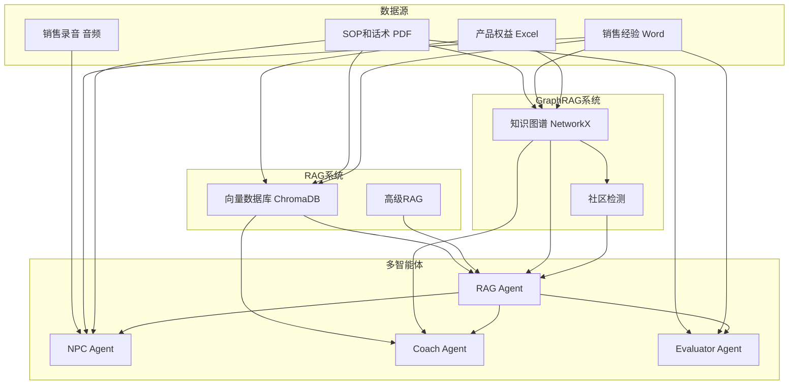

# 模块数据使用说明

## 概述

本文档说明 SalesBoost 系统中哪些模块会使用"销冠能力复制数据库"中的数据，以及如何使用。

---

## 📊 数据映射表

| 数据类型 | 文件格式 | RAG系统 | GraphRAG | NPC Agent | Coach Agent | Evaluator Agent |
|---------|---------|---------|----------|-----------|-------------|----------------|
| **产品权益** | Excel | ✅ | ✅ | ❌ | ✅ | ❌ |
| **竞品分析** | Excel | ✅ | ✅ | ❌ | ✅ | ✅ |
| **SOP和话术** | PDF/Word/PPT | ✅ | ✅ | ✅ | ✅ | ✅ |
| **销售冠军经验** | Word | ✅ | ✅ | ✅ | ✅ | ✅ |
| **销售录音** | 音频 | ❌ | ❌ | ✅ | ❌ | ✅ |

---

## 🔍 模块详细说明

### 1. RAG系统（向量检索）

**模块路径**：
- `app/services/knowledge_service.py` - 基础向量检索
- `app/services/advanced_rag_service.py` - 高级RAG
- `app/agents/rag_agent.py` - RAG Agent统一接口

**使用的数据**：
- ✅ **所有文档**（产品权益、SOP、话术、案例）

**数据用途**：
1. **向量存储**：所有文档内容被分块并转换为向量存储在ChromaDB中
2. **语义检索**：支持基于语义相似度的检索
3. **关键词检索**：BM25关键词检索
4. **混合检索**：向量+关键词的融合检索

**使用场景**：
```python
# 检索相关话术
result = await rag_agent.retrieve(
    query="如何处理价格异议",
    stage=SalesStage.OBJECTION_HANDLING,
    context={},
    top_k=5,
    mode="hybrid",
)
```

**数据流**：
```
文档 → DocumentProcessor（分块） → Embedding（向量化） → ChromaDB（存储）
                                                              ↓
                                                        检索时查询
```

---

### 2. GraphRAG系统（知识图谱）

**模块路径**：
- `app/services/graph_rag_service.py` - GraphRAG统一服务
- `app/services/graph_rag/relation_extractor.py` - 关系提取
- `app/services/graph_rag/graph_builder.py` - 图构建
- `app/services/graph_rag/graph_retriever.py` - 图检索

**使用的数据**：
- ✅ **SOP和话术**（提取话术-异议关系）
- ✅ **产品权益**（提取产品-特性-利益关系）
- ✅ **销售冠军经验**（提取成功案例和策略）

**数据用途**：
1. **实体提取**：从文档中提取实体（产品、特性、异议、话术等）
2. **关系提取**：提取实体间关系（话术-异议、产品-特性等）
3. **图构建**：构建知识图谱
4. **社区检测**：发现知识社区
5. **多跳推理**：支持多跳路径检索

**使用场景**：
```python
# 多跳推理：从异议找到应对话术
result = await graph_rag_service.search(
    query="年费太贵",
    stage="OBJECTION_HANDLING",
    mode="hybrid",  # 混合模式
    top_k=5,
)

# 异议专用检索
subgraph = await graph_rag_service.graph_retriever.retrieve_for_objection(
    objection_text="年费太贵",
    sales_stage="CLOSING",
    customer_type="价格敏感型",
)
```

**数据流**：
```
文档 → RelationExtractor（提取实体和关系） → SalesKnowledgeGraph（构建图）
                                                      ↓
                                              CommunityDetector（社区检测）
                                                      ↓
                                              GraphRetriever（检索）
```

---

### 3. NPC Agent（客户模拟）

**模块路径**：
- `app/agents/npc_agent.py` - NPC Agent
- `app/sales_simulation/agents/npc_agent.py` - 模拟环境NPC

**使用的数据**：
- ✅ **销售录音**（学习真实对话模式）
- ✅ **销售冠军经验**（学习客户行为模式）
- ✅ **SOP和话术**（了解常见异议和回应）

**数据用途**：
1. **对话模式学习**：从销售录音中学习真实对话模式
2. **异议生成**：基于常见异议生成客户异议
3. **回应生成**：生成符合客户类型的回应
4. **情绪模拟**：模拟客户情绪变化

**使用场景**：
```python
# NPC生成客户回应
response = await npc_agent.generate_response(
    user_message="我们的产品首年免年费",
    stage=SalesStage.PRODUCT_INTRO,
    context={
        "customer_type": "价格敏感型",
        "npc_mood": 0.6,
    },
)
```

**数据流**：
```
销售录音 → STT（语音转文字） → 对话模式提取 → NPC Agent训练
SOP/话术 → 异议模式提取 → NPC Agent异议生成
```

---

### 4. Coach Agent（销售教练）

**模块路径**：
- `app/agents/coach_agent.py` - Coach Agent

**使用的数据**：
- ✅ **SOP和话术**（销售技巧和策略）
- ✅ **销售冠军经验**（成功案例）
- ✅ **产品权益**（产品知识）

**数据用途**：
1. **实时建议**：基于当前对话提供销售建议
2. **话术推荐**：推荐合适的话术
3. **案例分享**：分享相关成功案例
4. **策略指导**：提供销售策略指导

**使用场景**：
```python
# Coach提供建议
advice = await coach_agent.generate_advice(
    user_message="客户说年费太贵",
    stage=SalesStage.OBJECTION_HANDLING,
    context={
        "customer_type": "价格敏感型",
        "product": "信用卡",
    },
)
```

**数据流**：
```
当前对话 → RAG检索（相关话术/案例） → Coach Agent → 生成建议
```

---

### 5. Evaluator Agent（评估器）

**模块路径**：
- `app/agents/evaluator_agent.py` - Evaluator Agent

**使用的数据**：
- ✅ **SOP和话术**（评估标准）
- ✅ **销售冠军经验**（最佳实践）

**数据用途**：
1. **表现评估**：评估销售表现
2. **对比分析**：对比最佳实践
3. **改进建议**：提供具体改进建议
4. **评分**：给出量化评分

**使用场景**：
```python
# 评估销售表现
evaluation = await evaluator_agent.evaluate(
    conversation_history=history,
    stage=SalesStage.CLOSING,
    golden_strategy=best_practice,
)
```

**数据流**：
```
对话历史 → 与最佳实践对比 → Evaluator Agent → 评估结果
```

---

### 6. RAG Agent（知识检索统一接口）

**模块路径**：
- `app/agents/rag_agent.py` - RAG Agent

**使用的数据**：
- ✅ **所有文档**（统一检索入口）

**数据用途**：
1. **统一检索**：提供统一的检索接口
2. **混合检索**：结合向量检索和图检索
3. **结果融合**：融合多种检索结果
4. **来源引用**：提供结果来源引用

**使用场景**：
```python
# 统一检索接口
result = await rag_agent.retrieve(
    query="如何处理价格异议",
    stage=SalesStage.OBJECTION_HANDLING,
    context={},
    top_k=5,
    mode="hybrid",  # 混合模式：向量+图
)
```

**数据流**：
```
查询 → RAG Agent → 向量检索 + 图检索 → 结果融合 → 返回
```

---

## 🔄 数据流转图



---

## 📝 数据使用优先级

### P0（核心功能）

1. **RAG系统**：所有文档 → 向量检索
2. **GraphRAG系统**：SOP和话术 → 知识图谱
3. **Coach Agent**：SOP和话术 → 销售建议

### P1（重要功能）

4. **NPC Agent**：销售录音 → 对话模拟
5. **Evaluator Agent**：销售经验 → 评估标准

### P2（增强功能）

6. **GraphRAG社区检测**：全局知识摘要
7. **多跳推理**：复杂查询处理

---

## 🚀 快速开始

### 1. 运行数据摄入

```bash
python scripts/ingest_sales_data.py
```

### 2. 验证数据

```python
from app.services.knowledge_service import KnowledgeService
from app.services.graph_rag_service import GraphRAGService

# 检查向量数据库
knowledge_service = KnowledgeService()
print(f"文档数: {knowledge_service.count_documents()}")

# 检查知识图谱
graph_rag = GraphRAGService()
stats = graph_rag.get_statistics()
print(f"节点数: {stats['graph']['total_nodes']}")
print(f"边数: {stats['graph']['total_edges']}")
```

### 3. 测试检索

```python
from app.agents.rag_agent import RAGAgent
from app.schemas.fsm import SalesStage

rag_agent = RAGAgent(use_advanced_rag=True, use_graph_rag=True)

# 测试检索
result = await rag_agent.retrieve(
    query="如何处理价格异议",
    stage=SalesStage.OBJECTION_HANDLING,
    context={},
    top_k=5,
)

print(f"检索到 {len(result.retrieved_content)} 条结果")
for item in result.retrieved_content:
    print(f"- {item.content[:100]}...")
```

---

## 📚 相关文档

- [数据摄入指南](DATA_INGESTION_GUIDE.md) - 详细的数据摄入步骤
- [GraphRAG实现报告](GRAPH_RAG_IMPLEMENTATION_COMPLETE.md) - GraphRAG系统说明
- [RAG升级计划](RAG_UPGRADE_PLAN.md) - RAG系统说明


