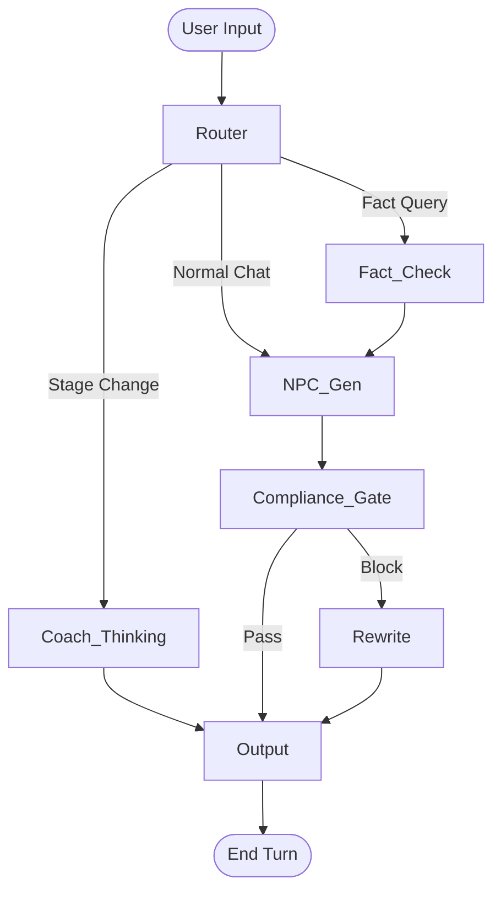

# SalesBoost 最佳实践架构设计 (Best Practice Architecture Design)

基于 "4 Capability Agents + 1 Orchestrator + 1 Compliance Gate" 的 2026 级工程化方案。

## 1. 核心架构概览 (Architecture Overview)

本方案采用 **集中式编排 (Centralized Orchestration)** 与 **图导向工作流 (Graph-based Workflow)**，确保业务逻辑的可观测性、合规性与可扩展性。

### 核心组件
1.  **Orchestrator (编排器)**: 系统的"大脑"，负责状态管理、路由分发、工具调用决策与上下文组装。
2.  **Compliance Gate (合规门)**: 独立的"安全卫士"，所有对用户输出必须经过此关卡。
3.  **Capability Agents (能力智能体)**:
    *   **NPC Agent**: 客户模拟。
    *   **Knowledge/Fact Agent**: 事实校验与知识检索。
    *   **Sales Coach Agent**: 销售教练建议。
    *   **Evaluator Agent**: 课后评估。

---

## 2. 智能体规格说明 (Agent Specifications)

### 2.1 NPC Agent (客户模拟)
*   **职责**: 基于 Persona 生成逼真的客户对话、异议与情绪反应。
*   **权限白名单**: 无（纯文本生成）。
*   **Input Schema**:
    ```json
    {
      "history": [{"role": "sales", "content": "..."}],
      "persona": {"name": "...", "description": "...", "objections": [...]},
      "stage": "discovery"
    }
    ```
*   **Output Schema**:
    ```json
    {
      "content": "我主要担心价格太高...",
      "mood": 0.4,
      "intent_hint": "price_objection"
    }
    ```

### 2.2 Knowledge/Fact Agent (知识与事实)
*   **职责**: 检索权益、费用、活动信息，确保事实准确。
*   **权限白名单**: `retrieval.search`, `db.get_benefit`, `db.get_fee`.
*   **Input Schema**:
    ```json
    {
      "query": "现在的优惠活动是什么？",
      "context": "..."
    }
    ```
*   **Output Schema**:
    ```json
    {
      "fact_check_result": "当前活动为开学季大促，优惠85折...",
      "evidence": [{"source": "campaign_2026_q1.pdf", "content": "..."}],
      "missing_info": false
    }
    ```

### 2.3 Sales Coach Agent (教练)
*   **职责**: 实时分析对话阶段，提供话术建议与指导。
*   **权限白名单**: `stage.classify`.
*   **Input Schema**:
    ```json
    {
      "history": [...],
      "sales_state": {"current_stage": "..."}
    }
    ```
*   **Output Schema**:
    ```json
    {
      "stage_detection": "objection_handling",
      "advice": "客户在关注价格，尝试用价值锚定法...",
      "suggested_script": "与其关注单价，不如看看我们能带来的回报..."
    }
    ```

### 2.4 Evaluator Agent (评估)
*   **职责**: 会话结束后进行多维评分。
*   **权限白名单**: `eval.score`.
*   **Input Schema**:
    ```json
    {
      "session_id": "...",
      "full_history": [...]
    }
    ```
*   **Output Schema**:
    ```json
    {
      "scores": {"empathy": 8, "logic": 7, "closing": 6},
      "feedback": "...",
      "improvements": ["..."]
    }
    ```

---

## 3. 编排工作流 (Orchestration Workflow)

采用 **LangGraph** 风格的有向图设计。

### 3.1 节点定义 (Nodes)
*   **Input**: 接收用户 WebSocket 消息。
*   **Router**: 意图识别与初步路由（决定是直接 NPC 回复，还是需要查知识库，还是触发教练）。
*   **NPC_Gen**: 生成客户回复。
*   **Fact_Check**: (Optional) 调用 Knowledge Agent 校验/补充信息。
*   **Coach_Thinking**: (Optional) 并行运行，生成教练建议。
*   **Compliance_Gate**: 最终出口检查。
*   **Output**: 发送 WebSocket 消息。

### 3.2 边与流转 (Edges)


### 3.3 集中式工具调用 (Centralized Function Calling)
Orchestrator 负责所有工具调用的实际执行。Agents 仅输出 **Tool Request**。

*   **流程**:
    1.  Agent 输出: `{"tool_call": "db.get_fee", "args": {"type": "vip"}}`
    2.  Orchestrator 拦截: 检查权限 -> 执行工具 -> 获取结果。
    3.  Orchestrator 回填: 将结果注入 Agent 上下文 -> Agent 重新生成文本。

---

## 4. 工具注册表 (Tool Registry)

### 4.1 规范
所有工具必须包含：
*   **Name**: 唯一标识符。
*   **Description**: 供 LLM 理解的用途描述。
*   **Parameters (Schema)**: 输入参数验证规则。
*   **Permissions**: 允许调用的 Agent 角色列表。

### 4.2 MVP 工具清单
| Tool Name | Signature | Description | Allowed Agents |
| :--- | :--- | :--- | :--- |
| `retrieval.search` | `(query: str, kb: str) -> List[Doc]` | 多路检索知识库 | Knowledge, Orchestrator |
| `db.get_benefit` | `(level: str) -> Dict` | 查询会员权益结构化数据 | Knowledge |
| `compliance.scan` | `(text: str) -> ScanResult` | 文本合规性检测 | Orchestrator (Auto) |
| `stage.classify` | `(history: List) -> str` | 销售阶段分类 | Coach, Orchestrator |
| `log.event` | `(type: str, payload: Any)` | 审计日志记录 | All (via System) |

---

## 5. 实施路线图 (Implementation Roadmap)

1.  **Refactor Agents**: 将现有 Agent 类重构为纯粹的 Prompt+Schema 包装器，移除内部的工具调用逻辑。
2.  **Build Orchestrator**: 引入 `langgraph` (或自研轻量级图引擎)，实现上述节点流转。
3.  **Implement Compliance**: 独立实现合规检测模块，并接入 Orchestrator 的输出管道。
4.  **Centralize Tools**: 建立 `ToolRegistry`，统一管理工具执行与权限校验。
