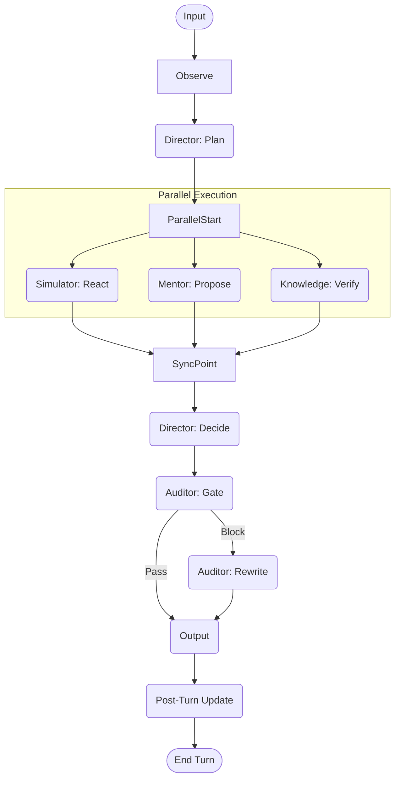

# SalesBoost 智能销售控制系统设计 (Sales Control System Architecture)

> **版本**: 2.0 (Full Score / Control System Edition)
> **核心理念**: 闭环控制系统 (Closed-Loop Control System) + 策略显式化 (Explicit Strategy) + 证据链 (Evidence Trace)

## 1. 架构哲学 (Architecture Philosophy)

本方案超越传统的 "Chatbot" 模式，将销售对话视为一个 **可控的决策过程**。
系统不仅仅是在"回复"，而是在执行 **Observe (观察) -> Plan (规划) -> Decide (决策) -> Act (行动) -> Learn (学习)** 的控制循环。

### 1.1 核心原则
1.  **State as First-Class Citizen**: 状态是系统的核心，而非副作用。
2.  **Strategy as Object**: 策略是显式的结构化对象，而非一段文本建议。
3.  **Compliance as Invariant**: 合规是系统的物理定律，不可违背。
4.  **Auditability by Default**: 所有决策必须可追溯证据与原因。

---

## 2. 核心组件 (Core Components)

### 2.1 系统层 (System Layer)
*   **Blackboard (共享黑板)**: 系统的唯一真值来源 (Source of Truth)。
    *   存储: `SalesStage`, `CustomerProfile`, `StrategyHistory`, `RiskTags`, `EvidenceCache`.
*   **Evidence & Telemetry (证据与观测)**:
    *   `DecisionTrace`: 记录 "谁提议、谁裁决、为什么"。
    *   `EvidenceLink`: 关联 RAG Chunk ID 或 DB Version。

### 2.2 职能层 (Functional Layer)
1.  **Director (战略层/编排器)**:
    *   职责: 状态机流转、并发调度、策略仲裁 (Arbitration)。
    *   输出: `Plan`, `SelectedStrategy`.
2.  **Simulator (表现层/客户世界模型)**:
    *   职责: 生成客户行为与情绪事件。
    *   输出: `CustomerResponse`, `EmotionEvent`.
3.  **Mentor (战术层/策略生成器)**:
    *   职责: 生成 **Strategy Objects** (含话术候选、假设、风险)。
    *   输出: `List[StrategyObject]`.
4.  **Auditor (约束层/合规门)**:
    *   职责: 强制拦截与改写。
    *   输出: `ComplianceVerdict` (Pass/Block/Rewrite).

---

## 3. (A) 策略对象定义 (Strategy Object Schema)

Mentor Agent 不再只输出文本，而是输出结构化的策略对象，供 Director 仲裁。

```python
from typing import List, Optional
from pydantic import BaseModel, Field

class EvidenceReference(BaseModel):
    source_id: str      # KB Chunk ID or DB Record ID
    source_type: str    # "rag", "db", "rule"
    content_snippet: str
    confidence: float

class RiskAssessment(BaseModel):
    risk_type: str      # "compliance", "oversell", "misleading"
    severity: str       # "low", "medium", "high"
    description: str

class ScriptCandidate(BaseModel):
    text: str
    tone: str           # "empathetic", "assertive", "professional"
    rationale: str      # Why this specific wording?

class StrategyObject(BaseModel):
    """
    Mentor 产出的核心交付物
    """
    strategy_id: str            # e.g., "STG-VALUE-ANCHOR-001"
    strategy_name: str          # e.g., "Value Anchoring"
    
    # 1. 假设 (Hypothesis)
    hypothesis: str             # "Customer is price-sensitive, shifting focus to ROI will reduce resistance."
    target_state_change: str    # "PriceResistance: High -> Medium"
    
    # 2. 候选话术 (Candidates)
    script_candidates: List[ScriptCandidate]
    
    # 3. 风险 (Risks)
    risks: List[RiskAssessment]
    
    # 4. 证据 (Evidence)
    evidence: List[EvidenceReference]
    
    # 5. 元数据
    priority: float             # Mentor's internal scoring (0.0-1.0)
    tags: List[str]             # ["closing", "price", "vip"]
```

---

## 4. (B) LangGraph 编排设计 (Orchestration Graph)

采用图导向 (Graph-based) 的控制流，支持并发执行与强制合规。

### 4.1 状态定义 (State)

```python
class BlackboardState(TypedDict):
    # Inputs
    user_input: str
    session_id: str
    
    # Shared Context
    sales_stage: str
    customer_profile: Dict
    
    # Intermediate Outputs (Parallel Streams)
    simulator_output: Optional[Dict]
    mentor_strategies: List[StrategyObject]
    knowledge_facts: List[Dict]
    
    # Decisions
    selected_strategy: Optional[StrategyObject]
    final_script: str
    
    # Audit
    compliance_verdict: Dict
    trace_log: List[Dict]
```

### 4.2 图结构 (Graph Topology)



### 4.3 节点逻辑 (Node Logic)

1.  **Observe**: 
    *   加载 `Blackboard` 历史状态。
    *   接收 `user_input`。

2.  **Plan (Director)**:
    *   判断当前意图与阶段。
    *   决定是否需要调用 Mentor 或 Knowledge (例如简单寒暄可能跳过 Mentor)。
    *   输出 `next_steps`.

3.  **Parallel Execution**:
    *   **Simulator**: 基于 `user_input` 生成 `mood_change`, `intent_detected`.
    *   **Mentor**: 基于 `sales_stage` + `user_input` 检索策略库，生成 `List[StrategyObject]`.
    *   **Knowledge**: (如有必要) 检索 DB/KB，输出 `Facts`.

4.  **Arbitrate (Director)**:
    *   **输入**: Mentor 的策略候选 + Simulator 的情绪反馈 + Knowledge 的事实。
    *   **逻辑**: 
        *   如果 Simulator 情绪极差 -> 优先选择 "Empathy" 类策略。
        *   如果 Knowledge 发现事实错误 -> 强制修正 Mentor 的话术。
        *   从 `script_candidates` 中选出最优的一条。
    *   **输出**: `selected_strategy`, `draft_response`.

5.  **Constrain (Auditor)**:
    *   **输入**: `draft_response`.
    *   **逻辑**: 执行 `compliance.scan`.
    *   **输出**: `verdict` (Pass/Block).

6.  **Learn**:
    *   异步更新 DB 中的 `CustomerProfile` 和 `SalesStage`。
    *   记录 `DecisionTrace`.

---

## 5. 工具层设计 (Tool Layer - The "Iron Laws")

### 5.1 集中式调用 (Centralized Execution)
所有 Agent 仅产出 `ToolRequest`，由 Director 或 Runtime 统一执行。

### 5.2 插件分类
1.  **Mentor 专用**:
    *   `kb_retriever`
    *   `facts_db_get`
    *   `strategy_matcher`
2.  **Simulator 专用**:
    *   `persona_provider`
    *   `emotion_sim`
3.  **Auditor 专用**:
    *   `compliance_guard`
4.  **System 专用**:
    *   `semantic_cache`
    *   `trace_log`

## 6. 总结 (Conclusion)

此架构通过引入 **Blackboard** 和 **Strategy Object**，将"聊天"升级为"控制"。
*   **可控性**: Director 拥有绝对的仲裁权。
*   **可观测性**: 每一轮的 Strategy Object 和 Evidence 都是持久化的证据。
*   **可扩展性**: 新增策略只需在 Mentor 中增加模板，无需修改编排逻辑。
