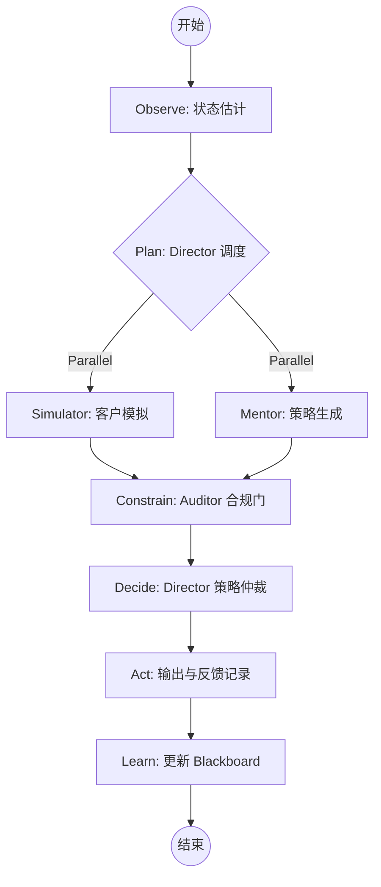

# LangGraph 闭环执行流程设计 (LangGraph Execution Flow Design)

本设计采用 LangGraph 承载 SalesBoost 的**闭环控制系统**架构。

## 1. 状态定义 (Blackboard State)
LangGraph 的 `State` 将作为系统的 **Blackboard (共享黑板)**。

```python
class BlackboardState(TypedDict):
    # 基础信息
    session_id: str
    turn_number: int
    history: List[Dict[str, str]]
    
    # 状态估计 (State Estimation)
    current_stage: str
    customer_psychology: Dict[str, float] # {trust, resistance, interest}
    detected_intent: str
    
    # 决策空间 (Decision Space)
    npc_response_candidates: List[str]
    strategy_candidates: List[StrategyObject]
    selected_strategy_id: str
    
    # 约束与证据 (Constraints & Evidence)
    compliance_results: Dict[str, Any]
    evidence_pack: List[Evidence]
    
    # 遥测 (Telemetry)
    decision_trace: List[str]
    telemetry_events: List[Dict[str, Any]]
```

---

## 2. 节点设计 (Nodes)

### 2.1 Observe (观察节点)
- **输入**: 用户原始消息。
- **动作**: 调用 `intent_gate` 与 `psychology_estimator`。
- **更新**: `detected_intent`, `customer_psychology`。

### 2.2 Plan (规划节点 - Director)
- **动作**: 判定是否需要进入并发分支。
- **逻辑**: 如果是事实咨询，优先触发 `Knowledge_Fetch`；如果是销售对话，触发 `Parallel_Work`。

### 2.3 Parallel_Work (并行执行)
- **Simulator Node**: 生成 NPC 回应。
- **Mentor Node**: 并行调用检索与策略库，产出 `StrategyObject` 列表。
- **Knowledge Node**: (可选) 异步检索权益事实。

### 2.4 Constrain (约束节点 - Auditor)
- **动作**: 强制门。对所有 `strategy_candidates` 中的 `script_candidates` 进行合规扫描。
- **输出**: 过滤掉违规项，或对风险项进行标记/改写。

### 2.5 Decide (决策节点 - Director)
- **动作**: **策略仲裁 (Strategy Arbitration)**。
- **逻辑**: 基于 `expected_effect` 与当前 `customer_psychology` 的匹配度，选出最优 `strategy_id`。

### 2.6 Act & Learn (执行与学习)
- **动作**: 输出最终文本。
- **更新**: 更新 Blackboard 中的长线变量（如阶段变迁），记录 `decision_trace`。

---

## 3. 图拓扑结构 (Topology)



---

## 4. 高级特性 (Advanced Features)

### 4.1 推测执行 (Speculative Execution)
在 `Plan` 阶段，如果置信度高，可以预先加载可能的策略模板，减少 LLM 等待时间。

### 4.2 语义缓存 (Semantic Caching)
对高频出现的“权益咨询”或“标准异议”，在 `Observe` 后直接命中缓存，跳过 `Parallel_Work`，实现秒回。

### 4.3 容错与降级 (Fallback)
- 如果 `Mentor` 超时，`Decide` 节点将使用启发式基准话术（Heuristic Baseline）。
- 如果 `Auditor` 异常，默认进入“最严约束模式”，仅输出标准官方话术。

### 4.4 闭环反馈 (Closed-loop Feedback)
记录 `adoption_signal`。如果学员多次拒绝某类策略，`Mentor` 在后续轮次中将自动降低该类策略的权重。
