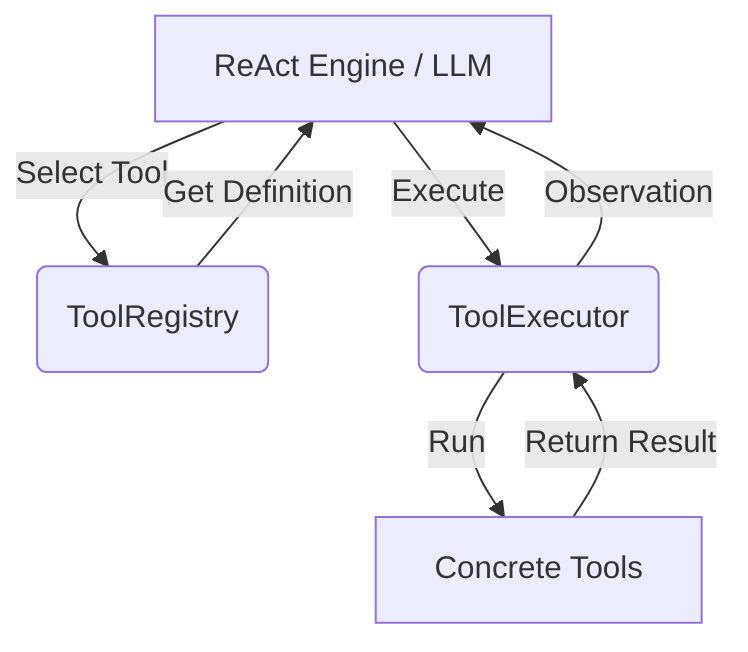

# SalesBoost 工具调用系统设计 (Tool Calling System Design)

## 1. 现状分析 (Current State Analysis)

### 1.1 现有代码
- **Protocol Definition**: `cognitive/contracts.py` 定义了基础 `Tool` 协议（`name`, `run`），但缺乏 Schema 定义（用于 LLM 描述）。
- **Implementation**: 
  - `app/tools/retriever.py`: 实现了检索逻辑，但未遵循 `Tool` 协议。
  - `app/tools/connectors/`: 包含部分连接器代码，结构较为散乱。
- **Orchestration**: `WorkflowCoordinator` 目前主要通过硬编码调用 Agent（NPC, Coach），缺乏通用的工具调用/分发机制。

### 1.2 目标架构 (Target Architecture)
参考 `REFACTORING_PREVIEW.md` 和 `interaction_engineering_upgrade.md`：
- **核心理念**: ReAct-Driven (Reasoning + Acting)。
- **层级定位**: `app/tools` 作为 "Limb Extension Layer" (肢体扩展层)。
- **交互模式**: 
  - **ReAct**: Thought -> Action (Tool Call) -> Observation (Tool Output) -> Reflection。
  - **Native Function Calling**: 适配支持 Function Calling 的模型（如 GPT-4, DeepSeek-V3）。

---

## 2. 系统架构设计 (System Architecture)

### 2.1 核心组件 (Core Components)

1.  **Tool Protocol (Enhanced)**:
    - 增加 `description`: 用于 LLM 理解工具用途。
    - 增加 `parameters`: JSON Schema，用于参数验证和 LLM 生成。
    - 保持 `run`: 异步执行入口。

2.  **ToolRegistry**:
    - 集中注册与管理所有可用工具。
    - 提供 `get_tools_schema()` 供 LLM System Prompt 使用。
    - 提供 `get_tool(name)` 供执行器调用。

3.  **ToolExecutor**:
    - 安全执行环境（异常捕获、超时控制）。
    - 统一的输入/输出格式标准化。

### 2.2 工具清单 (Tool Inventory)

根据 SalesBoost 业务场景（销售教练），规划以下核心工具：

| 工具名称 | 标识 (name) | 用途 (Description) | 关键参数 | 优先级 |
| :--- | :--- | :--- | :--- | :--- |
| **知识检索** | `knowledge_retriever` | 检索销售话术、产品知识、案例库 | `query` (str), `top_k` (int) | P0 |
| **客户画像** | `profile_reader` | 查询客户的基本信息、历史偏好、性格特征 | `field` (str) | P0 |
| **合规检查** | `compliance_check` | 检查生成的建议是否符合监管要求 | `text` (str) | P1 |
| **价格计算** | `price_calculator` | 计算折扣、总价、ROI | `items` (list), `discount` (float) | P2 |
| **CRM 动作** | `crm_action` | 模拟 CRM 操作（如记录跟进、更新阶段） | `action_type` (str), `data` (dict) | P2 |

### 2.3 调用策略 (Calling Strategy)

#### 策略 A: Native Function Calling (优先)
- **适用场景**: 模型支持 Function Calling (如 DeepSeek-V3, GPT-4)。
- **机制**: 将 `tools` schema 直接传入 API `tools` 参数。
- **优点**: 准确率高，解析由模型底层处理。

#### 策略 B: ReAct Prompting (回退)
- **适用场景**: 模型不支持 FC 或需要显式推理链。
- **机制**: 在 System Prompt 中注入工具描述，要求模型输出 `Action: tool_name\nAction Input: json`。
- **优点**: 通用性强，可解释性好（能看到 Thought）。

#### 策略 C: 混合模式 (Hybrid)
- **Coach Agent**: 使用 ReAct 模式，因为需要通过 Thought 展示"教练的思考过程"给用户看（教育价值）。
- **NPC Agent**: 使用 Native FC，注重响应速度和准确性。

---

## 3. 设计理由 (Design Rationale)

1.  **为什么是这些工具？**
    - `knowledge_retriever`: 销售教练的核心是"知识"，必须能从文档库提取实时信息。
    - `profile_reader`: 个性化建议的基础，解决"千人一面"的问题。
    - `compliance_check`: 销售场景的高压线，必须有独立工具保障。

2.  **为什么需要 Registry？**
    - 解耦：Agent 不需要知道工具的具体实现，只需要知道工具的定义。
    - 动态性：可以根据 `InteractionConfig` 动态启用/禁用某些工具（如 A/B 测试）。

3.  **为什么选择 ReAct？**
    - 对于 SalesBoost，**推理过程（Thought）本身就是产品价值的一部分**。用户不仅想知道"怎么做"，还想知道"为什么要这样做"。ReAct 天然暴露了思考链路。

## 4. 下一步实施 (Implementation Plan)

1.  **定义协议**: 升级 `cognitive/contracts.py` 中的 `Tool`。
2.  **实现基类**: 创建 `app/tools/base.py` 提供 `BaseTool`。
3.  **迁移检索**: 将 `app/tools/retriever.py` 改造为 `KnowledgeRetrieverTool`。
4.  **构建 Registry**: 实现 `app/tools/registry.py`。
5.  **集成**: 在 `SalesCoachAgent` 中集成 `ToolExecutor`。
