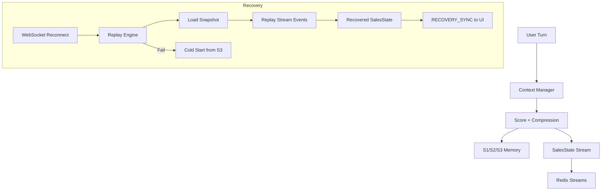
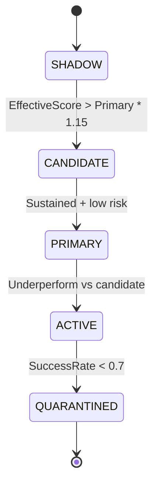

# Context Lifecycle & Self-Healing

## Overview
This document describes the end-to-end lifecycle for SalesBoost context:
- Context production (scoring + compression)
- Redis Streams replay for recovery
- Self-healing on reconnect
- Long-term memory consolidation
- Model lifecycle governance (Shadow -> Candidate -> Primary)

## State Replay & Self-Healing Flow

## Replay Engine Design
- **Inputs**: `session_id`, optional snapshot
- **Process**: replay Redis Streams in order; de-dup by `turn_id`
- **Output**: recovered `SalesState` with consistent stage + facts
- **Idempotency**: repeated events are ignored

## Self-Healing Guarantees
- Reconnect always attempts Replay first
- If Redis unavailable, fallback to S3 summary
- UI receives `RECOVERY_SYNC` with:
  - current stage
  - confirmed facts
  - compressed summary

## Long-Term Memory Consolidation
- Session finish triggers S3 aggregation
- Extract:
  - high-frequency errors
  - strengths / skill tags
  - compliance flags
- Store as student profile for next session bias

## Model Lifecycle Governance

### Rules Summary
- **EffectiveScore** = model_score * intent_weight * success_rate
- **Promotion** requires min calls + success rate threshold
- **Auto-quarantine** when success rate < 0.7
- **Anomaly** if score drop >= 2.0

## Lifecycle Job (Background)
- **Job**: `LifecycleJob` runs on a timer in the background task manager.
- **Inputs**: model history, success window, intent distribution.
- **Outputs**: lifecycle action, anomaly status, audit log event.
