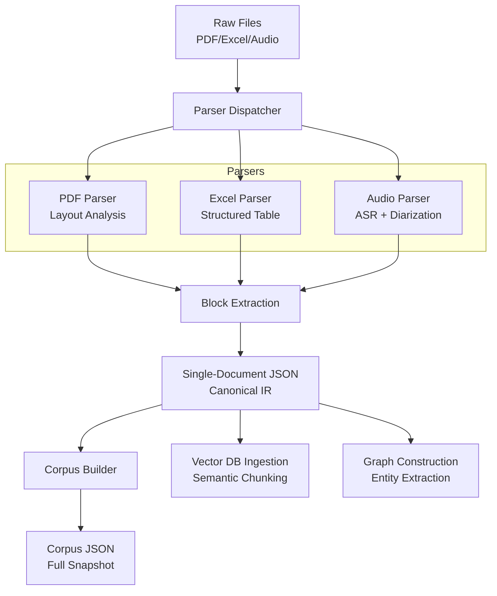

# RAG Ingestion v2 - System Design

## 1. 总体架构 (Architecture)

The system follows a strict **"Raw -> Canonical JSON -> Downstream"** flow to ensure data integrity and reconstructibility.

## 2. 单文件 JSON Schema (Canonical IR)

See `app/services/ingestion/v2/schemas.py`.

**Key Design Decisions:**
*   **Block-based**: Content is not a string, but a list of typed blocks (`heading`, `table`, `turn`).
*   **Provenance**: Every block retains `bbox` (PDF), `page`, or `timestamp` (Audio) to trace back to source.
*   **Structured Data**: Tables are stored as structured objects, not Markdown text, allowing downstream to choose how to serialize them (CSV, Markdown, HTML).

## 3. 合并 JSON (Corpus JSON)

*   **Format**: A simple container wrapping a list of `CanonicalDocument`.
*   **Storage**: Filesystem / S3 (Immutable blobs).
*   **Usage**: 
    *   **Rebuild**: Delete Vector DB -> Read Corpus JSON -> Re-run Chunking -> Re-insert.
    *   **GraphRAG**: Feed Corpus JSON to Graph Builder to detect cross-document entities.

## 4. 各模态 Parser 职责

| Modality | Parser Responsibility | Output Block Types |
| :--- | :--- | :--- |
| **PDF** | Layout Analysis (OCR if needed), remove headers/footers, link captions to images. | `heading`, `paragraph`, `table`, `image` |
| **Excel** | Identify header rows, merge cells logic, separate sheets. | `table` (with `rows` and `cells`) |
| **Audio** | STT (Speech-to-Text), Speaker Diarization, Timestamping. | `turn` (with `speaker`, `start`, `end`) |
| **Word** | Extract hierarchy (H1-H3), preserve lists. | `heading`, `list`, `paragraph` |

## 5. 下游接口约定 (Interface Contract)

### To Chunking (SemanticChunker)
*   **Input**: `CanonicalDocument` (JSON)
*   **Logic**:
    *   Iterate over `blocks`.
    *   Respect `block_type`:
        *   `heading`: Starts new section path.
        *   `table`: Kept as atomic chunk (unless too huge).
        *   `turn`: Grouped by speaker turn.
*   **Output**: `Chunk` objects (ready for embedding).

### To GraphRAG
*   **Input**: `Corpus` (JSON)
*   **Logic**:
    *   Extract entities from `blocks` text.
    *   Use `metadata` (doc category) to define node types.
    *   Link `block_id` as provenance for every relation.

### To Evaluation
*   **Input**: `CanonicalDocument`
*   **Logic**: Use `confidence` score in blocks to flag low-quality OCR/ASR for human review.
